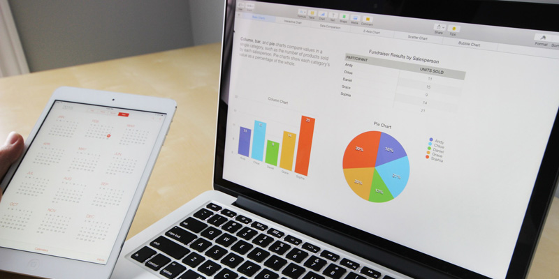

 
Mengintegrasikan infrastruktur teknologi dan informasi untuk mengakselarasikan operasional perusahaan / organisasi anda ke arah yang lebih efisien dan efektif dapat tercapai dengan menggunakan layanan dari kami. Layanan Aplikasi Bisnis Terintegrasi ini merupakan layanan untuk segmen korporasi atau organisasi yang memiliki sumber daya yang cukup besar. 

Organisasi dan korporasi yang memiliki banyak kantor cabang dapat terhubung layaknya berada pada satu gedung dengan mengintegrasikan seluruh aplikasi pada setiap komputernya melalui jaringan pribadi, hal tersebut akan membuat operasional bisnis dan organisasi anda menjadi lebih efisien.

**All-In-One Business Management Software** yang terdiri dari beberapa aplikasi dengan fungsi khusus dan bisa disesuaikan dengan kebutuhan akan menambah efisiensi pengelolaan organisasi dan korporasi anda.

Aplikasi-aplikasi seperti *CRM, ERP, Project Management, Sales Management, Point of Sale (POS), Accounting, Human Resources, Inventory Management* dan lain sebagainya bisa anda dapatkan dalam satu paket **All-In-One Business Management Software**.
 
Putra Binangkit dapat membantu anda untuk melakukan instalasi dan konfigurasi aplikasi-aplikasi tersebut untuk kemudian saling terhubung melalui sebuah jaringan pribadi.

Aplikasi-aplikasi bisnis tersebut bisa mengakselarasi operasional perusahaan dan organisasi anda menjadi lebih efisien daripada sebelumnya. Semua itu bisa anda dapatkan dengan memesan layanan Aplikasi Bisnis Terintegrasi dari Putra Binangkit.
