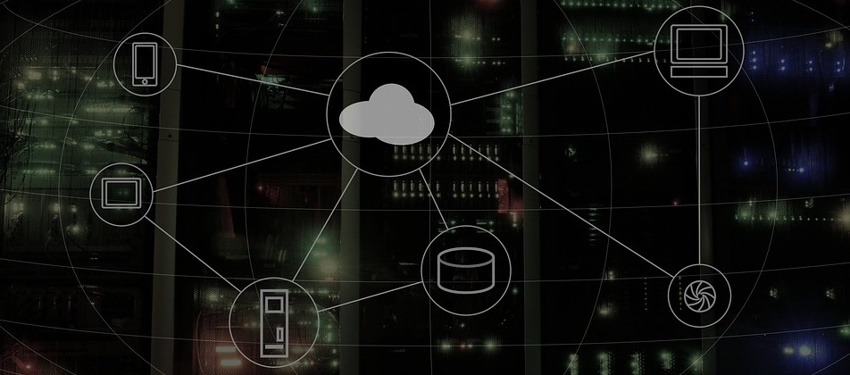

 
Menjadikan seluruh komputer pada *ecosystem* perusahaan atau organisasi anda terhubung pada sebuah jaringan dapat meningkatkan efektifitas operasional organisasi atau perusahaan anda, keuntungan dari terhubungnya seluruh komputer pada satu jaringan terintegrasi adalah seperti mudahnya berbagi file, dokumen, printer dan koneksi internet antar komputer.

Selain kemudahan tersebut anda juga bisa mengintegrasikan aplikasi bisnis melalui jaringan yang terhubung, namun tentnya perlu dipastikn terlebih dahulu bahwa aplikasi bisnis anda telah mendukung fasilitas integrasi melalui jaringan.

Layanan instalasi jaringan yang kami tawarkan sangat fleksibel dan telah termasuk *setup*, anda bisa memilih menggunakan jaringan fixedwire ataupun wireless. Selain itu layanan instalasi jaringan kami juga tidak dibatasi oleh jarak, anda tetap bisa membangun jaringan pribadi meskipun antar negara. 
